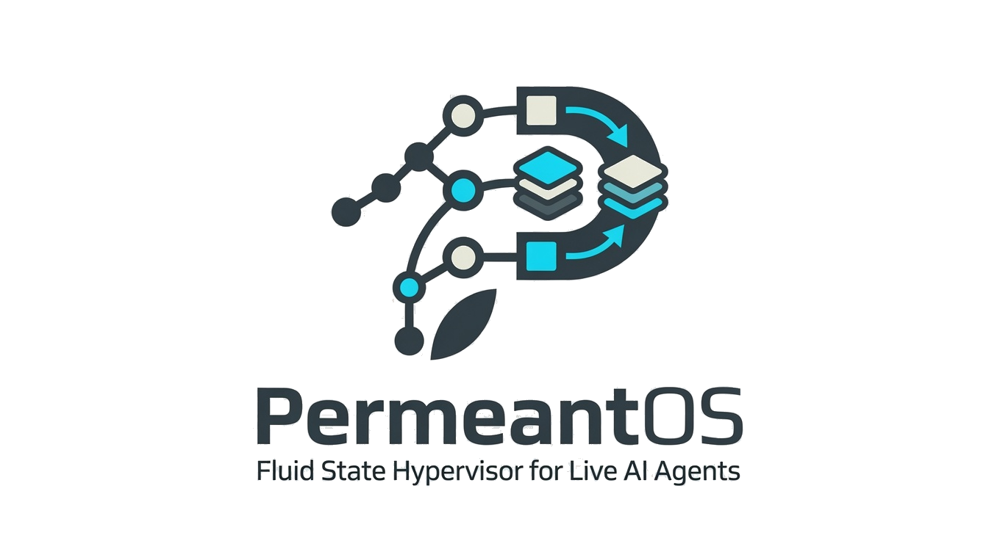

<p align="center">
  
</p>

# PermeantOS

PermeantOS is an experimental state-fluid hypervisor for live AI agent migration. It currently focuses on cross-host KV-cache migration between heterogeneous runtimes, with a longer-term roadmap toward full Agent Memory Graph migration. The first graph milestone, the v0 schema and specification, is now defined.

The current prototype has demonstrated a real end-to-end migration from a local Apple Silicon MLX source runtime to an AWS NVIDIA vLLM target runtime. In the validated run, PermeantOS migrated a `Qwen/Qwen2.5-0.5B-Instruct` KV cache, wrote it into vLLM target blocks, seeded vLLM prefix-cache metadata, and matched the source continuation exactly for a 16-token validation horizon.

## Status

Research preview. The system is significant enough to study, reproduce, and contribute to, but it is not yet production software.

What works today:

- Rust daemon/client migration protocol.
- Capability exchange and two-phase commit.
- Encrypted and signed transfer envelope.
- CRC-checked streaming payloads.
- Manifest generation and benchmark capture.
- MLX live source adapter.
- vLLM live target adapter with target block allocation, KV writes, prefix-cache seeding, and fidelity probes.
- Repeatable AWS real-runtime E2E runner with cleanup verification.
- Conservative AWS prewarm image/container recipe for faster E2E bootstrap without always-on infrastructure.
- Structured benchmark manifest summaries for paper/update tables and failure records.
- Multi-horizon decode-fidelity analysis over captured source, baseline, and post-migration continuations.
- Larger-context benchmark matrix planning with checked vLLM context-window requirements.
- Exact short-horizon MLX-to-vLLM continuation fidelity for one validated Qwen run.
- Agent Memory Graph v0 schema and specification for portable conversation, tool, artifact, memory, checkpoint, provenance, and KV-span state.
- Minimal local Agent Memory Graph export/import harness with deterministic prompt reconstruction, content-addressed artifact packaging, artifact hash verification, and restored-workspace validation.
- Local artifact migration safety policies for redacted/excluded artifacts, explicit external rebind requirements, and streaming artifact verification/restoration.
- Local tool-call replay safety audit for completed side effects, retry-safe read-only pending work, manual resume policies, and unsafe replay rejection.
- Local vector/retrieval memory snapshot validation and external vector-store rebind reporting.
- Agent Memory Graph adapter conformance layer with LangGraph-style durable-state and MCP-backed tool/resource session mappings.
- Local Agent Memory Graph security policy gate with signed-root attestation, provenance chain checks, secret rejection, credential rebinding, and target/tool/artifact allowlists.
- Optional Agent Memory Graph hash metadata in migration manifests.

What is still experimental:

- Runtime adapters rely on Python because MLX and vLLM expose the needed internals through Python APIs.
- The vLLM attachment path uses implementation details that may change between vLLM versions.
- Fidelity has been validated for one model family and a 16-token continuation horizon.
- Cloud validation is expensive and slow on cold hosts unless a prewarmed image is used.
- Longer-horizon, larger-context, and transfer-quantization fidelity batches are
  still future benchmark work.

## Repository layout

- `crates/`: Rust crates for USXF core logic, transport, orchestration, injector, extractor, and CLI.
- `adapters/`: Python runtime adapters and bridge tools for MLX, vLLM, Runpod, and analysis.
- `docs/`: runbooks, design notes, validation reports, and paper draft.
- `examples/agent-memory-graph/`: local Agent Memory Graph export/import harness and framework adapter conformance mappings.
- `sdk/python/`: early Python SDK package.
- `scripts/`: repeatable cloud validation scripts.
- `ROADMAP.md`: detailed roadmap toward full agent memory graph migration.

## Key documents

- `ROADMAP.md`: full roadmap, including Agent Memory Graph migration phases.
- `docs/agent-memory-graph.md`: Agent Memory Graph v0 schema specification.
- `docs/agent-memory-graph-threat-model.md`: local graph import threat model and Phase 8 security controls.
- `docs/schemas/agent-memory-graph-v0.schema.json`: machine-readable JSON Schema for the graph envelope.
- `docs/agent-framework-adapters.md`: Agent Memory Graph adapter capability manifest, compatibility matrix, and conformance rules.
- `docs/usxf-arxiv-paper.md`: paper draft covering USXF, PermeantOS, and real-runtime E2E findings.
- `paper/arxiv/`: arXiv-oriented LaTeX submission bundle.
- `docs/website/white-paper.md`: website-friendly technical white paper.
- `docs/deployment-and-testing-guide.md`: local, cloud-host, manifest, benchmark, and Runpod workflow guide.
- `docs/benchmark-summary-tooling.md`: structured manifest summary and paper-table tooling.
- `docs/fidelity-horizon-suite.md`: multi-horizon decode-fidelity comparison tooling.
- `docs/context-benchmark-matrix.md`: larger-than-2k context benchmark planning.
- `docs/aws-real-runtime-e2e-runner.md`: repeatable AWS real-runtime E2E runner and cleanup/resume runbook.
- `docs/aws-prewarm-image.md`: conservative AWS image/container prewarm recipe and cost guardrails.
- `docs/graph-attached-kv-migration-plan.md`: Phase 3 graph-attached live KV migration plan and acceptance criteria.
- `docs/runtime-adapter-protocol.md`: command-backed extractor/injector contract.
- `docs/real-runtime-bringup.md`: live runtime bring-up notes.
- `docs/aws-real-runtime-fidelity-followup-2026-06-16.md`: fidelity investigation history.

## Validated real-runtime result

Latest successful fidelity run:

| Field | Value |
| --- | --- |
| Run ID | `20260616-230743` |
| Manifest | `migration-20260616-231535-66524-manifest.json` |
| Source | local MLX on Apple Silicon |
| Target | AWS `g4dn.xlarge`, vLLM `0.23.0` |
| Model | `Qwen/Qwen2.5-0.5B-Instruct` |
| Prefix length | 2016 tokens |
| Layers | 24 |
| Hash validation | passed |
| Slot probe max key diff | `0.0` |
| Slot probe max value diff | `0.0` |
| Prefix-cache seeded blocks | 16 |
| Decode fidelity | exact source/post-migration match for 16 generated tokens |
| Cleanup | instance, security group, and key pair deleted |

The earlier apparent fidelity gap at a longer prefix was traced to target context-window exhaustion, not a KV migration defect.

## Quick start

Prerequisites:

- Rust toolchain.
- Python 3.10+ for adapters.
- Optional: Apple Silicon with MLX for live source tests.
- Optional: AWS account with GPU quota for real vLLM target tests.

Build the Rust CLI:

```bash
cargo build
```

Run a local simulated migration target:

```bash
./target/debug/permeant-cli daemon --addr 127.0.0.1:9099
```

In another terminal, run a simulated migration:

```bash
./target/debug/permeant-cli sim-migrate --target-addr 127.0.0.1:9099 --seq-len 512
```

For real-runtime MLX-to-vLLM validation, start with:

```bash
scripts/aws-real-runtime-e2e.sh run
```

Read `docs/aws-real-runtime-e2e-runner.md` first. The script provisions billable AWS GPU infrastructure and is designed to clean up after itself, but you should understand the state file and cleanup command before running it. To reduce cold-start setup time without leaving infrastructure running, see `docs/aws-prewarm-image.md`.

Summarize migration manifests after a local or cloud batch:

```bash
scripts/summarize-benchmark-manifests.py benchmark-manifests/<run-label> \
  --markdown-out benchmark-manifests/<run-label>/summary.md
```

Analyze captured continuation fidelity across multiple token horizons:

```bash
scripts/analyze-fidelity-horizons.py \
  --source /tmp/permeant-source-continuation.json \
  --probe .permeant-e2e/aws/<run-id>/vllm-runtime-probe.json \
  --horizons 16,32,64 \
  --markdown-out .permeant-e2e/aws/<run-id>/fidelity-horizons.md
```

Plan larger-than-2k context benchmark points:

```bash
scripts/plan-context-benchmarks.py \
  --markdown-out benchmark-manifests/context-matrix.md \
  --env-out benchmark-manifests/context-matrix.env
```

## Benchmark snapshot

| Run | Target | Source mode | Transport | Seq len | Total time (ms) | Effective bandwidth (Gbps) | Manifest |
| --- | --- | --- | --- | ---: | ---: | ---: | --- |
| AWS real-runtime fidelity | `g4dn.xlarge` | live MLX | SSH tunnel + vLLM prefix-cache attachment | 2016 | see run doc | see run doc | `migration-20260616-231535-66524-manifest.json` |
| AWS GPU | `g4dn.xlarge` | live MLX | SSH tunnel to daemon | 2048 | 25245.342833 | 0.001438227963385703 | `migration-20260615-215310-60139-manifest.json` |
| AWS real runtime | `g4dn.xlarge` | live MLX | SSH tunnel + in-process vLLM hook | 2048 | 49105.921208 | 0.0016397366763484056 | `migration-20260615-232818-54818-manifest.json` |
| AWS CPU fallback | `t3.medium` | live MLX | SSH tunnel to daemon | 2048 | 23106.294833 | 0.0017053993142176205 | `migration-20260615-195032-6976-manifest.json` |
| Runpod live-source proof | RTX 3090 | live MLX | SSH tunnel to daemon | 2048 | 156377.4295 | 0.00011692589682723728 | `migration-20260614-154223-70658-manifest.json` |
| Runpod HTTP-bridge proof | RTX 3090 | live MLX | HTTP bridge | 2048 | 54649.212125 | 0.0016446839797195588 | `migration-20260614-195346-87816-manifest.json` |

## Agent Memory Graph Progress

The next major milestone is full Agent Memory Graph migration: conversation turns, tool calls, artifacts, vector memories, pending work, provenance, and KV spans in one transactional migration envelope.

Completed:

- Agent Memory Graph v0 schema and specification.
- Machine-readable JSON Schema with validation fixture and contract tests.
- Published schema identifier: `https://www.permeantos.org/schemas/agent-memory-graph-v0.schema.json`.
- Minimal local graph export/import harness with deterministic prompt reconstruction, artifact hash verification, prompt token hash capture, and simulated KV hash validation.
- Optional graph hash, artifact hash, prompt hash, and simulated KV hash fields in migration manifests.
- Optional graph-to-KV span metadata in migration manifests when an Agent Memory Graph package is supplied.
- Content-addressed artifact packaging and restored-workspace verification in the local graph harness.
- Artifact redaction/exclusion policies, explicit external rebind validation, and streaming large-file artifact verification/restoration in the local graph harness.
- Tool-call replay safety audit in the local graph harness, including no-replay preservation for completed external writes, retry-safe read-only pending calls, manual resume requirements, and rejection of unsafe side-effect retries.
- Vector/retrieval memory support in the local graph harness, including deterministic vector snapshots, embedding/index compatibility checks, retrieval equivalence validation, and hosted vector-store rebind reporting.
- Agent framework adapter conformance for two independent runtime families: LangGraph-style durable state and MCP-backed tool/resource sessions.
- Security, provenance, and policy hardening in the local graph harness, including signed-root metadata, provenance-chain audit evidence, raw secret rejection, credential rebind enforcement, and target/tool/artifact allowlists.
- Adapter-side graph span metadata emitted by the MLX live runtime and validated against the vLLM target tokenizer view before target ingest.
- Daemon transaction binding for manifest-referenced graph packages, rejected before commit when required graph/KV evidence is incomplete or does not match the migrated KV header.
- Analyzer reporting for prompt, graph, graph/KV span, and KV alignment in fidelity summaries.
- Graph-attached live KV migration planning notes and acceptance criteria.

Remaining:

- Full graph package byte streaming and durable target-side graph session storage.

See `ROADMAP.md` for the detailed phased plan.

## Contributing

Contributions are welcome, especially around:

- Runtime adapters.
- Manifest and analyzer tooling.
- Agent Memory Graph export/import and adapter implementations.
- Reproducible benchmarks.
- Security review.
- Documentation and examples.

Read `CONTRIBUTING.md` before opening a pull request.

## Security

PermeantOS handles sensitive context state. Do not publish real user context, secrets, cloud credentials, private model prompts, or generated migration manifests containing sensitive data.

Report vulnerabilities using the process in `SECURITY.md`.

## License

Licensed under the Apache License, Version 2.0. See `LICENSE`.

Apache-2.0 is used because PermeantOS is infrastructure software where a permissive license plus an explicit patent grant is preferable for broad academic, startup, and commercial adoption.
