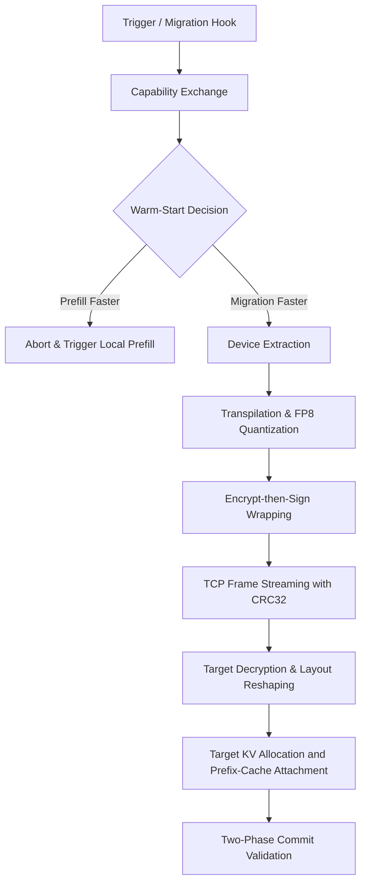

# USXF: A Unified State Exchange Format and Fluid Hypervisor for Cross-Hardware AI Agent Migration

**Authors:**  
*K. Budu* (Project Lead, PermeantOS)  
*Antigravity AI* (Advanced Agentic Coding Research Group, Google DeepMind)  

**Date:** June 17, 2026  
**Status:** Preprint (Draft v1.2)

---

## Abstract
Long-running autonomous AI agents require the ability to migrate dynamically across heterogeneous cloud clusters and local edge environments. However, live state migration--specifically the transmission of large Key-Value (KV) caches--is currently bottlenecked by framework-specific layouts, vendor-locked hardware runtimes (NVIDIA CUDA vs. Apple Metal), and high context-reprefill latencies. In this paper, we present **PermeantOS**, a state-fluid hypervisor, and **USXF (Unified State Exchange Format) v1.1**, an open interchange format that decouples KV cache state from underlying runtimes. USXF defines a versioned metadata schema alongside a cryptographic, compressed payload envelope. We detail the mathematical layout transformations between canonical sequential representations and blocked execution formats, evaluate FP8 transfer quantization schemes, and define a warm-start decision boundary comparing prefill complexity to network transmission capacity. In addition to analytical break-even estimates showing up to an 8x resume-latency reduction for contexts larger than 32k tokens over 25 Gbps links, we report a real cross-runtime validation: a local Apple Silicon MLX source migrated a Qwen2.5 KV cache to an AWS NVIDIA `g4dn.xlarge` vLLM target, where all 24 layers passed hash and slot-probe validation and post-migration decode matched the source continuation exactly for the 16-token validation horizon.

---

## 1. Introduction
The rise of autonomous agent architectures requires continuous, multi-turn reasoning loops. In these workflows, the agent's context window acts as a persistent working memory. As conversation histories expand to $32k$–$128k+$ tokens, the memory footprint of the Key-Value (KV) cache grows into gigabytes. 

When an agent must migrate—due to node eviction, scheduling optimization, or transitioning between edge devices (such as an Apple Silicon MacBook running macOS Metal) and cloud servers (such as NVIDIA CUDA clusters)—re-establishing the context requires recalculating the prompt's attention states. This process, known as **re-prefilling**, incurs quadratic computational costs:
\[T_{\text{prefill}} \propto \mathcal{O}(L \cdot S^2 \cdot D)\]
where $L$ is the number of layers, $S$ is the sequence length, and $D$ is the hidden dimensionality. For long contexts, re-prefilling introduces multiple seconds of latency, interrupting the agent's real-time interaction loop.

While prior research has explored disaggregated KV caching (e.g., LMCache, Mooncake) and paged memory layouts (e.g., vLLM, PegaFlow), these implementations are tightly bound to specific deep learning frameworks and hardware targets. They lack:
1. **Cross-Hardware Portability:** The ability to migrate KV cache seamlessly between Metal (Apple Silicon GQA GPU buffers) and CUDA (NVIDIA tensor cores).
2. **First-Class Agent Semantics:** Incorporating conversation turn boundaries, template states, and agent identity metadata directly into the transfer envelope.
3. **Rigorous Security Envelopes:** Preventing data exfiltration of raw context tokens or intermediate activations during transit across untrusted network zones.

To address these limitations, we introduce **PermeantOS** and the **USXF v1.1** specification. PermeantOS provides a lightweight, rust-based hypervisor sidecar that manages live migration through a clean Two-Phase Commit (2PC) protocol. USXF v1.1 acts as the canonical exchange medium, translating framework-specific physical layouts into a secure, standardized serialization format.

---

## 2. System Architecture
PermeantOS operates as a sidecar daemon running alongside model inference servers. The migration pipeline follows a structured, sequential lifecycle:



1. **Capability Exchange:** The source and target daemons negotiate hardware, model weights revision, attention mechanics (GQA vs. MLA), and block-allocation limits.
2. **Warm-Start Evaluation:** The orchestrator runs an empirical decision boundary calculation to ensure migration is faster than local context prefilling.
3. **Extraction:** The source hypervisor extracts key-value tensors from active engine runtimes (Apple Metal Device buffers or CUDA tensors).
4. **Transpilation & Quantization:** Tensors are reshaped from vendor-specific memory layouts to the USXF canonical layout. Tensors are optionally quantized to FP8 (E4M3) to compress the payload.
5. **Security Wrapping:** The JSON header and payload chunks are sealed using an **Encrypt-then-Sign** scheme.
6. **Streaming:** Data is streamed in chunks over a length-prefixed TCP socket. Each frame includes a CRC32 checksum for corruption detection.
7. **Injection:** The target decrypts and reshapes tensors to the target runtime's blocked configuration. In the current vLLM validation path, PermeantOS allocates target KV blocks, writes migrated key/value tensors directly into those physical slots, and seeds vLLM prefix-cache metadata so the next decode request attaches to the migrated prefix.
8. **Two-Phase Commit:** A final validation check verifies cache state continuity before switching the active inference engine to the target node.

---

## 3. The USXF v1.1 Specification
USXF separates at-rest archival snapshots from active wire-streaming envelopes. 
* **At-Rest Format:** Serialized as a single `Safetensors` file containing a JSON metadata header block and the flat binary tensor arrays.
* **Wire Format:** Structured as length-prefixed JSON frames for command signals, followed by binary stream packages for tensor layers.

### 3.1 Metadata Header Schema
The JSON metadata block provides the self-describing context for the migrated state:

```json
{
  "usxf_version": "1.1",
  "model_architecture": "Llama-3.1-8B-Instruct",
  "model_identity": {
    "config_hash": "sha256:7f8e9a2b3c4d5e6f7a8b9c0d1e2f3a4b5c6d7e8f9a0b1c2d3e4f5a6b7c8d9e0f",
    "weights_revision": "hf:meta-llama/Llama-3.1-8B-Instruct@main"
  },
  "attention_type": "gqa",
  "model_cache_spec": {
    "n_layers": 32,
    "n_q_heads": 32,
    "n_kv_heads": 8,
    "head_dim": 128,
    "hidden_size": 4096,
    "max_position_embeddings": 131072,
    "rope_theta": 500000.0,
    "sliding_window": null
  },
  "chat_state": {
    "template_name": "llama-3.1-instruct",
    "template_hash": "sha256:...",
    "turn_boundaries": [0, 142, 890, 1024],
    "roles": ["system", "user", "assistant", "user"]
  },
  "token_ids": [128000, 1043, 3421, 400, 2993],
  "seq_len": 5,
  "batch_size": 1,
  "dtype": "bfloat16",
  "transfer_quantization": {
    "scheme": "fp8",
    "group_size": null,
    "scales": null
  },
  "block_size": 256,
  "block_hashes": ["sha256:abc123..."],
  "created_at": "2026-06-13T22:10:00Z",
  "extractor_id": "permeant-os-candle-v0.3.1",
  "checksum": "sha256:def456...",
  "signature": "ed25519:..."
}
```

---

## 4. Mathematical Formulations & Reshaping
The core mathematical challenge in cross-hardware migration is mapping between the **Canonical Sequential Layout** and the **Target Blocked Layout**.

### 4.1 Canonical Sequential Layout
In USXF, the extracted key $K_{\text{canon}}$ and value $V_{\text{canon}}$ tensors for each layer are stored in continuous sequential representations:
\[K_{\text{canon}} \in \mathbb{R}^{S \times H_{\text{kv}} \times D_{\text{head}}}\]
\[V_{\text{canon}} \in \mathbb{R}^{S \times H_{\text{kv}} \times D_{\text{head}}}\]
where $S$ is the sequence length, $H_{\text{kv}}$ is the number of Key-Value attention heads, and $D_{\text{head}}$ is the hidden dimension of each head.

### 4.2 vLLM Blocked Layout
In the target execution engine (e.g., vLLM), physical memory is allocated in non-contiguous pages or blocks of size $B$ (typically $B = 256$ tokens). 

For optimal memory coalescing in GPU attention kernels, Key and Value tensors are reshaped differently:
* **Key Block Layout:** Key states are laid out to prioritize fast access along the block size dimension:
  \[K_{\text{vllm}} \in \mathbb{R}^{M \times H_{\text{kv}} \times D_{\text{head}} \times B}\]
  where $M = \lceil S / B \rceil$ is the number of blocks. The transformation mapping from canonical coordinates $(s, h, d)$ to blocked indices $(m, h, d, b)$ is defined as:
  \[m = \lfloor s / B \rfloor, \quad b = s \pmod B\]
  \[K_{\text{vllm}}[m, h, d, b] = K_{\text{canon}}[s, h, d]\]
  If $S$ is not a multiple of $B$, the remaining slots in the last block are padded with zeros:
  \[K_{\text{vllm}}[M-1, h, d, b] = 0 \quad \forall \quad b \ge (S \pmod B)\]

* **Value Block Layout:** Value states are organized to match sequence token access patterns directly:
  \[V_{\text{vllm}} \in \mathbb{R}^{M \times H_{\text{kv}} \times B \times D_{\text{head}}}\]
  with coordinates mapped via:
  \[V_{\text{vllm}}[m, h, b, d] = V_{\text{canon}}[s, h, d]\]

### 4.3 Quantization Math
To maximize network bandwidth utilization, values are compressed to FP8 E4M3 representations. The E4M3 byte format allocates 1 sign bit, 4 exponent bits, and 3 mantissa bits with a bias of 7.

The scaling factor $s_x$ is computed dynamically per tensor to map values to the maximum representable E4M3 number ($448.0$):
\[s_x = \frac{\max(|X|)}{448.0}\]
Quantization maps elements $x_i \in X$ to bytes $q_i$:
\[q_i = \text{clip}\left(\text{round}\left(\frac{x_i}{s_x}\right), -448.0, 448.0\right)\]
Dequantization at the target side reconstructs values prior to layout reshaping:
\[\hat{x}_i = q_i \cdot s_x\]

---

## 5. Security Architecture
Because AI agent memory contains sensitive user text, tool outputs, and API tokens, protecting data integrity and confidentiality during transfer is critical. PermeantOS implements an **Encrypt-then-Sign** security envelope:

```
                  Source Node                                      Target Node
┌──────────────────────────────────────────────┐ ┌──────────────────────────────────────────────┐
│  Plaintext (USXF Header + Tensor Payload)    │ │   Verify Signature with Ed25519 Public Key   │
└──────────────────────┬───────────────────────┘ └──────────────────────▲───────────────────────┘
                       │                                                │
             1. Encrypt with AES-GCM-256                                │ 4. Decrypt with AES-GCM
                       ▼                                                │
┌──────────────────────────────────────────────┐ ┌──────────────────────┴───────────────────────┐
│     Ciphertext Payload + Nonce Vector        │ │       Authenticated Plaintext Header         │
└──────────────────────┬───────────────────────┘ └──────────────────────────────────────────────┘
                       │                                                ▲
               2. Sign with Ed25519                                     │ 3. Match CRC32
                       ▼                                                │
┌──────────────────────────────────────────────┐ ┌──────────────────────┴───────────────────────┐
│  Signed Cryptographic Packet (Safe for Wire)  ├─►  Network Transmission Stream (TCP Socket)   │
└──────────────────────────────────────────────┘ └──────────────────────────────────────────────┘
```

1. **Encryption:** The entire USXF packet is encrypted using AES-256-GCM with a unique 96-bit nonce.
2. **Signature:** An Ed25519 signature is generated over the combined `[ciphertext + nonce]` block using the source's private key.
3. **Transmission:** The packet is streamed over the wire. The target node verifies the signature *before* performing any decryption operations, defending against chosen-ciphertext attacks (IND-CCA2 security).
4. **Rate Limiting & Quotas:** The orchestrator enforces resource policies restricting max concurrent migrations (default = 4) and total memory allocations, protecting the target node from Denials of Service (DoS) caused by target buffer resource exhaustion.

---

## 6. Performance & Break-Even Analysis
The warm-start decision algorithm evaluates the inequality:
\[T_{\text{transfer}} \le \gamma \cdot T_{\text{prefill}}\]
where $\gamma = 0.7$ represents the conservative target savings margin.

We model the network transfer time as:
\[T_{\text{transfer}} = \frac{8 \cdot S_{\text{bytes}}}{B_{\text{network}}} + \delta\]
where $S_{\text{bytes}}$ is the payload size, $B_{\text{network}}$ is the bandwidth in bits per second, and $\delta = 150\text{ms}$ is fixed handshake overhead.

The prefill time on modern accelerators exhibits linear-to-quadratic behavior modeled as:
\[T_{\text{prefill}} = \alpha \cdot S + \beta \cdot S^2\]
where $\alpha = 1.0 \times 10^{-5}$ and $\beta = 6.0 \times 10^{-10}$ are empirical device coefficients.

### 6.1 Transition Analysis (Llama-8B Cache)
Below we analyze the transfer size and comparison times for a Llama-3.1-8B model cache (32 layers, 8 KV heads, 128 head_dim, Float16/BF16 precision):

| Context Size ($S$) | KV Cache Size (BF16) | KV Cache Size (FP8) | $T_{\text{transfer}}$ (10 Gbps, FP8) | $T_{\text{transfer}}$ (25 Gbps, FP8) | $T_{\text{prefill}}$ (Empirical) | Decision (25 Gbps, FP8) |
|---|---|---|---|---|---|---|
| **8,192** | 536 MB | 268 MB | 0.364 s | 0.235 s | 0.122 s | **Prefill (Local)** |
| **16,384** | 1.07 GB | 536 MB | 0.578 s | 0.321 s | 0.324 s | **Prefill (Local)** |
| **32,768** | 2.14 GB | 1.07 GB | 1.008 s | 0.493 s | 0.972 s | **Migrate (USXF)** |
| **64,536** | 4.29 GB | 2.14 GB | 1.860 s | 0.835 s | 3.220 s | **Migrate (USXF)** |
| **131,072** | 8.58 GB | 4.29 GB | 3.580 s | 1.523 s | 11.610 s | **Migrate (USXF)** |

At sequence lengths $\ge 32k$ tokens and network bandwidths $\ge 25\text{ Gbps}$ with FP8 transfer quantization, PermeantOS live migration becomes faster than local prefilling. The performance benefit increases at larger context sizes due to the quadratic computation complexity of attention calculation during prefilling.

---

## 7. Real-Runtime End-to-End Validation

To test whether USXF migration works beyond synthetic fixtures and analytical modeling, we ran a disposable cross-host validation using an Apple Silicon laptop as the source runtime and an AWS GPU VM as the target runtime.

### 7.1 Experimental Setup

The source host ran MLX with `Qwen/Qwen2.5-0.5B-Instruct`. The target host was an AWS `g4dn.xlarge` instance running vLLM `0.23.0` with the same model. PermeantOS exported a 2016-token source prompt/cache, streamed the encrypted migration over an SSH-tunneled daemon connection, registered the target-side KV blocks, seeded vLLM prefix-cache metadata, and generated a post-migration continuation from the migrated prefix.

The target context length was kept below the 2048-token model window to leave room for a 16-token validation continuation. An earlier run using a 2032-token source prefix produced an apparent source/target mismatch after 11 tokens; analysis showed that the target had reached its context limit and stopped early. Reducing the migrated prefix to 2016 tokens removed this confounder.

### 7.2 Validation Results

| Metric | Result |
|---|---|
| Run ID | `20260620-165344` |
| Migration manifest | `migration-20260620-170130-37116-manifest.json` |
| Source runtime | MLX, Apple Silicon laptop |
| Target runtime | vLLM `0.23.0`, AWS `g4dn.xlarge` |
| Model | `Qwen/Qwen2.5-0.5B-Instruct` |
| Migrated prefix length | 2016 tokens |
| Transfer quantization | `none` |
| Agent Memory Graph binding | 27-node complex package aligned |
| Layer count | 24 |
| Hash validation | Passed |
| Slot-probe max key diff | `5.000000025123796e-09` |
| Slot-probe max value diff | `5.000000025123796e-09` |
| vLLM prefix-cache seeded blocks | 16 |
| Source vs. post-migration decode | Exact match for 16 generated tokens |
| Target baseline vs. post-migration decode | Exact match for 16 generated tokens |
| Cleanup | AWS instance, security group, and key pair deleted |

These results validate the core live migration chain: MLX extraction, USXF transport, complex Agent Memory Graph transaction binding, target allocation, target KV write, hash validation, prefix-cache attachment, and post-migration decode reuse. The result is intentionally scoped: it demonstrates exact fidelity for one model family and a 16-token continuation horizon using raw, unquantized transfer. The migrated graph package contained 27 nodes, 25 edges, four packaged artifacts, memory/retrieval state, credential rebinding requirements, and pending tool policy. Longer continuation horizons, additional model architectures, quantized transfer variants, durable target-side graph session storage, and high-concurrency multi-tenant runs remain future evaluation work.

A matched FP8 transfer-quantized run on the same MLX-to-AWS-vLLM graph-attached
path reduced transferred bytes from 50,331,648 to 12,582,912 while preserving
exact 16-token source/post-migration continuation fidelity. The measured
transfer phase improved from 72.790 seconds to 63.020 seconds. Total migration
time improved modestly, from 396.127 seconds to 389.690 seconds, because the
cold disposable-host validation path is dominated by target commit/runtime
attachment and vLLM initialization effects. Strict sampled slot equality failed
under FP8 as expected for a lossy codec, with measured max sampled key/value
delta of 0.0125.

### 7.3 Engineering Finding: Context Window Accounting

The strongest negative finding from the validation cycle was not a tensor-layout error but a context-window accounting issue. vLLM tokenization and request construction can consume a few more target-side prompt tokens than a source-side text-length intuition suggests. If a migrated prefix is too close to the model's maximum context length, the target can truncate or stop generation before the source validation horizon completes. This produced a false fidelity gap in the 2032-token run. The harness now defaults to a 2016-token prefix for 2048-token target contexts, ensuring that continuation fidelity tests measure migration behavior rather than context exhaustion.

---

## 8. Related Work
This research builds upon several disaggregated caching and optimization frameworks:
* **LMCache:** Introduces a tiered distributed cache layer for KV caches. PermeantOS complements LMCache by defining an open, versioned format (USXF) that bridges Apple Silicon (Metal) and NVIDIA (CUDA) environments.
* **PegaFlow:** Uses a Rust sidecar and custom vLLM connectors to slide cache blocks. USXF generalizes these layout transfers into a framework-agnostic format, adding security envelopes and conversation turn-boundary metadata.
* **CacheGen & CacheBlend:** Investigates high-ratio KV cache compression algorithms. We leverage scaled FP8 quantization (E4M3) as a robust baseline and define the metadata structures to support future custom tensor compression algorithms.

---

## 9. Conclusion & Future Work
We have presented USXF v1.1 and the PermeantOS hypervisor stack. By decoupling the KV cache from vendor-locked runtimes and wrapping it in a secure, layout-agnostic structure, PermeantOS enables cross-hardware agent migration. The latest end-to-end validation demonstrates that this is not only a wire-format proposal: a real MLX source cache and complex Agent Memory Graph package can be migrated to a real vLLM target, registered into target KV storage, attached through prefix-cache metadata, and decoded with exact short-horizon source fidelity.

Future research directions include:
1. **Speculative Migration:** Initiating network streaming of prefix blocks before the active reasoning loop completes.
2. **Multi-Hop Provenance:** Embedding signing chains within the metadata header to allow verified routing across multiple intermediate nodes.
3. **Agent Memory Graph Integration:** Moving beyond simple linear KV token histories to support multi-agent state trees and memory graphs.
4. **Broader Fidelity Evaluation:** Repeating the MLX-to-vLLM validation across longer continuation horizons, larger contexts, additional model families, FP8 transfer quantization, and prewarmed cloud images to separate steady-state migration cost from cold infrastructure setup.
